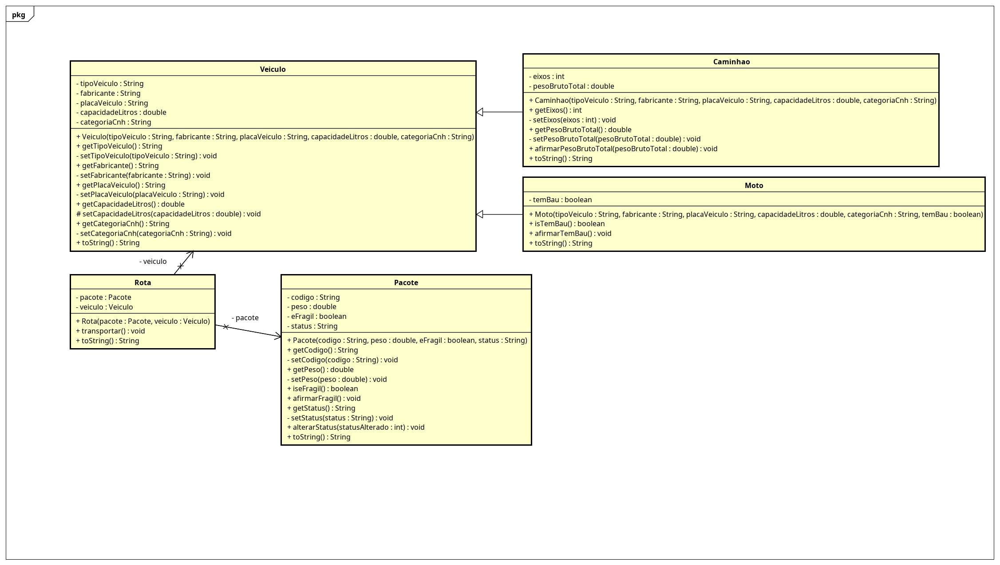

# Checkpoint 2 - POO

> **Data:** 24/04/2026  
> **Aluno:** Leonardo de Magalhães Piassa  
> **Professor:** Ygor Moraes Martins dos Anjos

### 🎯 Objetivo

Diagnosticar falhas arquitetônicas e de segurança em um código legado, aplicando princípios de Orientação a Objetos (encapsulamento, herança, associações) e Clean Code para refatorar e construir uma soluação escalável e manutenível.

#

### 🗃️ Statics:

**Imagem Astah - Resumo**:


**Arquivo:** [FiapDelivery.asta](src/br/com/fiapdelivery/statics/FiapDelivery.asta)


## 🛠️ Construção

### Funcionalidades:

- Cadastro de veículos de entrega
- Cadastro de motos e caminhões
- Cadastro de pacotes
- Validação de placa do veículo
- Validação de código do pacote
- Alteração de status da entrega
- Criação de rotas associando pacote e veículo
- Exibição das informações no console

### Estrutura do projeto:

```text
br.com.fiapdelivery
├── main
│   └── SistemaPrincipal.java
└── model
    ├── Veiculo.java
    ├── Moto.java
    ├── Caminhao.java
    ├── Pacote.java
    └── Rota.java
```

### Classes Principais:

**Veiculo**

Classe base para os veículos do sistema.  
Armazena informações como:

- Tipo do veículo
- Fabricante
- Placa
- Capacidade em litros
- Categoria da CNH

Também possui validações para impedir campos vazios, valores inválidos e placas fora do padrão `AAA0A00`.

**Moto**

Classe que herda de `Veiculo`.  
Representa uma moto de entrega e possui o atributo temBau, indicando se a moto possui baú. Caso a moto não tenha baú, sua capacidade é definida como 0.

**Caminhao**

Classe que herda de `Veiculo`.  
Representa um caminhão de entrega e possui atributos próprios, como:

- Quantidade de eixos
- Peso bruto total

Também possui métodos para atualizar essas informações com validação.

**Pacote**

Representa uma encomenda do sistema.

Armazena:

- Código do pacote
- Peso
- Informação se o pacote é frágil
- Status da entrega

O código do pacote deve seguir o padrão `AAA00AAA000`.

Rota

Representa a relação entre um pacote e um veículo.  
Ao chamar o método `transportar()`, o status do pacote é atualizado para "Saiu para entrega", e as informações da entrega são exibidas no console.

**Conceitos aplicados**

O projeto utiliza conceitos fundamentais de POO, como:

- Encapsulamento: atributos privados e acesso controlado por métodos.
- Herança: `Moto` e `Caminhao` herdam de `Veiculo`.
- Sobrescrita de métodos: uso do método `toString()` para exibir os objetos de forma organizada.
- Validação de dados: verificação de campos vazios, valores negativos e formatos inválidos.

**Exemplo de execução**

Durante a execução, o sistema cria veículos, pacotes e rotas. Em seguida, exibe as informações cadastradas e atualiza o status de uma entrega.

**Exemplo de saída**:
```bash
===== Veículos =====

Moto 1:
Tipo: Duas rodas (Moto)
Fabricante: Honda
Placa: ABC1D23
Capacidade: 80.0 L | 0.08 m³
Categoria: A
Tem baú: true

===== Pacotes =====

Pacote 1:
Código: ABC12DEF345
Peso: 2365.0 Kg
Status: Preparando

**Pedido saiu para entrega!**

Código do pacote: ABC12DEF345
Veículo de transporte: tipo:Duas rodas (Moto), placa:ABC1D23
Status: Saiu para entrega
```

#